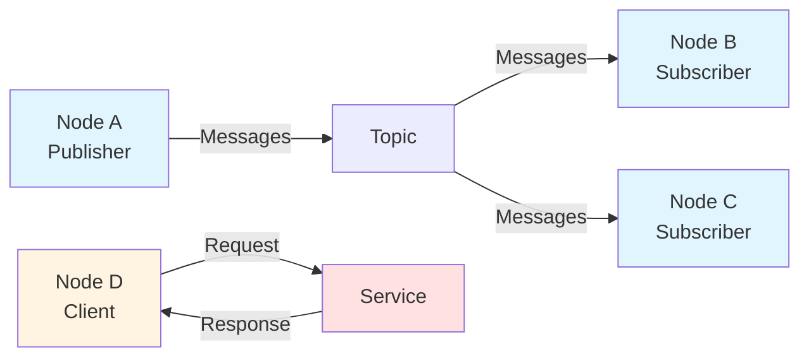

# Chapter 1: ROS 2 Fundamentals - The Robotic Nervous System

> **Learning Objectives**: By the end of this chapter, you will be able to:
> - Define ROS 2 Nodes, Topics, and Services in your own words
> - Explain the publish-subscribe communication pattern
> - Distinguish when to use Topics vs. Services for robot control
> - Create a basic ROS 2 Node using rclpy
> - Analyze how Nodes form the "nervous system" of a robot

## Prerequisites

- Basic Python knowledge (functions, classes, loops)
- Understanding of basic AI concepts
- Familiarity with command-line interface

## Introduction to ROS 2

**Robot Operating System 2 (ROS 2)** is a middleware framework that provides the tools, libraries, and conventions necessary to build complex robotic systems. Just as a biological nervous system enables communication between the brain, senses, and muscles, ROS 2 enables communication between different parts of a robotic system.

**Why ROS 2 for Humanoid Robots?**
Humanoid robots are complex systems with multiple joints, sensors, and actuators that must work together cohesively. ROS 2 provides:

- **Standardized communication**: Components can exchange data reliably
- **Modularity**: You can replace or upgrade individual components without rewriting the entire system
- **Scalability**: From simple single-robot setups to multi-robot fleets
- **Community support**: Thousands of packages and tools available

**The "Robotic Nervous System" Analogy**:
- **Nodes** = Individual neurons or processing centers
- **Topics** = Nerve pathways carrying signals
- **Messages** = Electrical impulses traveling through nerves
- **Services** = Direct requests requiring immediate response (like reflexes)

## ROS 2 Architecture

### Nodes: The Computational Units

A **Node** is a process that performs computation. In the context of a humanoid robot, you might have nodes for:

- Joint control (sending commands to motors)
- Sensor processing (reading cameras, IMUs, touch sensors)
- Path planning (calculating how to move from A to B)
- State estimation (determining the robot's position and orientation)

Nodes are independent and can be written in different programming languages (Python, C++, Java, etc.). They communicate with each other without knowing where other nodes are running—on the same robot, on a different computer, or even in the cloud.

### Topics: Asynchronous Communication

**Topics** are named buses over which nodes exchange messages. Topics follow the **publish-subscribe pattern**:

1. A node **publishes** messages to a topic
2. Other nodes **subscribe** to that topic to receive messages
3. Multiple publishers and multiple subscribers can exist for the same topic

**Example for Humanoid Robots**:
- `/humanoid/joint_commands` - Topic for sending motor commands
- `/humanoid/joint_states` - Topic for reading current joint positions
- `/humanoid/camera/image_raw` - Topic for camera images

The beauty of topics is **decoupling**: the publisher doesn't know who is subscribing, and subscribers don't know who is publishing. This makes your robot system flexible and modular.

### Services: Synchronous Communication

While topics are great for continuous data streams, sometimes you need immediate, one-to-one communication. This is where **Services** come in.

A **Service** provides a request-response interaction:
1. A client node sends a **request** to a service
2. The service node processes the request
3. The service sends back a **response**

**Example for Humanoid Robots**:
- `/humanoid/reset_pose` - Request: reset to standing pose, Response: confirmation
- `/humanoid/get_battery_level` - Request: check battery, Response: current percentage
- `/humanoid/calibrate_imu` - Request: start calibration, Response: success/failure

**When to Use Topics vs. Services**:
- **Use Topics** for: Continuous data streams (sensor readings, joint commands), events that multiple nodes might care about
- **Use Services** for: One-time requests (reset, calibration, configuration), tasks that need immediate confirmation



## The Publish-Subscribe Pattern

The publish-subscribe (pub-sub) pattern is fundamental to ROS 2. Here's how it works for a humanoid robot's arm control:

**Publisher Side (Controller Node)**:
```python
# Controller node decides to move the arm
joint_angle = 1.5  # radians
publisher.publish(joint_angle)  # Send to topic
```

**Subscriber Side (Motor Driver Node)**:
```python
# Motor driver receives the command
def callback(message):
    move_motor_to_position(message.data)
subscriber.register_callback(callback)
```

**Key Benefits for Robot Control**:

1. **Decoupling**: You can change the controller without touching the motor driver
2. **Scalability**: Add new sensors or actuators by subscribing to existing topics
3. **Multi-consumer**: Multiple nodes can monitor joint commands for logging, safety checks, etc.

**Real-World Example**: When your humanoid robot waves its hand:
- The gesture planner publishes hand trajectory to `/humanoid/left_hand/target`
- The arm controller subscribes and calculates joint angles
- Joint controllers subscribe to joint commands and send motor signals
- The monitoring system subscribes to all joint states for safety checks

All of this happens simultaneously without nodes knowing about each other!

## Introduction to rclpy

**rclpy** (ROS Client Library for Python) is the official Python library for creating ROS 2 applications. It provides all the tools you need to create nodes, publish messages, subscribe to topics, and create services.

### Basic Node Lifecycle

Every ROS 2 Python program follows this pattern:

```python
# 1. Initialize ROS 2 communications
rclpy.init()

# 2. Create a node
node = rclpy.create_node('my_node_name')

# 3. Set up publishers, subscribers, or services
# (code to create communication interfaces)

# 4. Spin the node (process callbacks)
rclpy.spin(node)

# 5. Clean up
node.destroy_node()
rclpy.shutdown()
```

**What Does "Spin" Mean?**
Spinning means the node enters a loop that:
1. Receives incoming messages
2. Calls the appropriate callback functions
3. Processes any timers or events
4. Repeats until shutdown

Without spinning, your node won't receive any messages even if you've set up subscribers!

## Common Pitfalls

### 1. Forgetting to Source the ROS 2 Environment

**Problem**: You get `command not found: ros2` errors.

**Solution**: Always source the ROS 2 setup before running any ROS 2 commands:
```bash
source /opt/ros/humble/setup.bash
```

**Prevention**: Add this line to your `~/.bashrc` file to source automatically on terminal startup.

### 2. Node Not Spinning

**Problem**: Your node starts but immediately exits, or callbacks never execute.

**Solution**: Make sure you call `rclpy.spin(node)` after setting up your node. Without spin, the node doesn't process incoming messages.

### 3. Topic Name Mismatches

**Problem**: Publisher and subscriber can't find each other.

**Solution**: Use exactly the same topic name, including leading slashes:
```python
# Publisher
publisher.create_publisher(String, '/humanoid/status', 10)

# Subscriber
subscriber.create_subscription(String, '/humanoid/status', callback, 10)
```

**Debugging Tip**: Use `ros2 topic list` to see all active topics and `ros2 topic echo <topic_name>` to see what's being published.

### 4. Incorrect QoS Settings

**Problem**: Subscribers don't receive messages even though topic names match.

**Solution**: Quality of Service (QoS) settings must be compatible. For beginners, use default QoS:
```python
# Default QoS (usually compatible)
publisher.create_publisher(String, '/topic', 10)  # 10 is queue size
```

## Summary

In this chapter, you learned:

- **ROS 2** provides the framework for building robotic systems
- **Nodes** are independent processes that perform computation
- **Topics** enable asynchronous communication via publish-subscribe
- **Services** enable synchronous request-response communication
- **rclpy** is the Python library for creating ROS 2 applications
- The **spin** mechanism processes incoming messages and callbacks

**Key Takeaway**: ROS 2's architecture enables you to build complex humanoid robot systems from simple, modular components that communicate through well-defined interfaces.

**Coming Next**: In Chapter 2, you'll learn how to create a Python agent that controls a simulated humanoid robot using the concepts you've learned here.

## References

- [ROS 2 Concepts Official Documentation](https://docs.ros.org/en/humble/Concepts/Basic.html)
- [rclpy Documentation](https://docs.ros.org/en/humble/p/rclpy/)
- [ROS 2 Tutorials - Understanding Nodes](https://docs.ros.org/en/humble/Tutorials/Beginner-Client-Libraries/Understanding-ROS2-Nodes.html)
