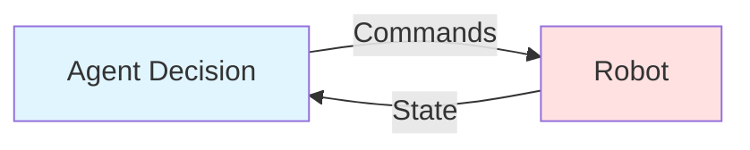

# Chapter 2: Python Agent Integration - Bridging AI with ROS 2

> **Learning Objectives**: By the end of this chapter, you will be able to:
> - Design a Python agent that publishes to ROS 2 Topics
> - Implement subscription to robot state topics for feedback
> - Handle connection errors and ROS 2 initialization failures
> - Create a complete agent controlling a simulated humanoid robot
> - Debug common issues in ROS 2 Python integration

## Prerequisites

- Completion of Chapter 1 (ROS 2 Fundamentals)
- Understanding of Nodes, Topics, and publish-subscribe pattern
- ROS 2 Humble environment installed
- Gazebo Fortress simulator installed (for testing)

## From Concepts to Control

In Chapter 1, you learned ROS 2's building blocks. Now we'll combine them into a working system: a Python agent that controls a humanoid robot.

**The Agent's Role**: An AI agent makes decisions and sends commands to a robot. Our agent will:
1. Decide robot actions (e.g., "wave left arm")
2. Publish commands to ROS 2
3. Subscribe to robot state for feedback
4. Adjust behavior based on current state

This **feedback loop** (decide → command → monitor → adjust) is the foundation of all robot control systems.

## Designing the Agent

Our agent uses two communication channels:

**1. Command Channel** (Agent → Robot):
- Topic: `/humanoid/command/joint_angles`
- Message: `sensor_msgs/JointState`
- Purpose: Send movement commands

**2. Feedback Channel** (Robot → Agent):
- Topic: `/humanoid/state/joint_angles`
- Message: `sensor_msgs/JointState`
- Purpose: Monitor current positions

This **closed-loop control** lets us verify commands are executed.



### Message Structure

We use ROS 2's standard `sensor_msgs/JointState` message:

```python
# Command message
msg.name = ['left_shoulder_pan', 'left_shoulder_lift', 'left_elbow']
msg.position = [0.0, 0.5, 1.2]  # Target angles (radians)
```

The same message type works for both commands and feedback—the difference is the **topic** and **direction**.

## Implementing the Publisher

Let's create the command publisher part of our agent.

### Creating the Publisher Node

```python
from sensor_msgs.msg import JointState
from rclpy.node import Node

class HumanoidController(Node):
    """Controls humanoid robot joints via ROS 2"""

    def __init__(self):
        super().__init__('humanoid_controller')

        # Create publisher for joint commands
        self.command_pub = self.create_publisher(
            JointState,
            '/humanoid/command/joint_angles',
            10  # Queue size
        )

        # Timer: send commands every 0.1 seconds (10 Hz)
        self.timer = self.create_timer(0.1, self.publish_commands)

        # Wave motion variables
        self.wave_phase = 0.0
```

### Publishing Joint Commands

```python
def publish_commands(self):
    """Publish joint angle commands to robot"""
    msg = JointState()

    # Specify joints to control
    msg.name = [
        'left_shoulder_pan',    # Horizontal rotation
        'left_shoulder_lift',   # Vertical movement
        'left_elbow',           # Elbow joint
    ]

    # Calculate wave motion
    self.wave_phase += 0.2
    msg.position = [
        0.0,                                   # Shoulder stationary
        0.5 + 0.3 * sin(self.wave_phase),      # Wave up/down
        1.2 + 0.5 * sin(self.wave_phase)       # Bend/unbend
    ]

    # Publish command
    self.command_pub.publish(msg)
    self.get_logger().info(f'Command: {list(msg.position)}')
```

**Why Abstract Commands?** We send high-level commands, not motor signals. This provides:
- **Modularity**: Agent doesn't need hardware details
- **Safety**: Robot controllers can limit movements
- **Interoperability**: Works with any humanoid using JointState

## Implementing Feedback

Commands are useless without knowing if they're executed. Let's add state monitoring.

### Subscribing to Robot State

```python
class HumanoidController(Node):
    def __init__(self):
        # ... publisher setup ...

        # Create subscriber for robot state
        self.state_sub = self.create_subscription(
            JointState,
            '/humanoid/state/joint_angles',
            self.state_callback,
            10
        )

        # Store current positions
        self.current_positions = {}

    def state_callback(self, msg):
        """Called when robot publishes new state"""
        # Update positions
        for i, name in enumerate(msg.name):
            self.current_positions[name] = msg.position[i]

        self.get_logger().info(f'State: {self.current_positions}')
```

### Callback Best Practices

1. **Keep it short**: Callbacks should execute quickly
2. **Use logging**: `get_logger().info()` not `print()`
3. **Handle errors**: Wrap risky code in try-except
4. **Avoid blocking**: Never sleep or do long computations

## Error Handling & Robustness

Real robots fail. Our agent must handle errors gracefully.

### Initialization Failures

```python
def main(args=None):
    try:
        rclpy.init(args=args)
    except Exception as e:
        print(f"ROS 2 init failed: {e}")
        print("Source setup with: source /opt/ros/humble/setup.bash")
        return 1

    controller = HumanoidController()
    try:
        rclpy.spin(controller)
    finally:
        controller.destroy_node()
        rclpy.shutdown()
```

### Detecting Disconnection

```python
class HumanoidController(Node):
    def __init__(self):
        # ... setup ...
        self.last_state_time = self.get_clock().now()
        self.watchdog = self.create_timer(1.0, self.check_connection)

    def state_callback(self, msg):
        self.last_state_time = self.get_clock().now()

    def check_connection(self):
        """Verify robot is still sending state"""
        elapsed = (self.get_clock().now() - self.last_state_time).nanoseconds / 1e9

        if elapsed > 2.0:  # No update for 2 seconds
            self.get_logger().warn('⚠️  Robot connection lost!')
```

### Graceful Degradation

When errors occur:
1. Log clearly
2. Stop sending commands if disconnected
3. Don't crash—handle exceptions in callbacks

```python
def state_callback(self, msg):
    try:
        positions = dict(zip(msg.name, msg.position))
        # Process positions...
    except (KeyError, IndexError) as e:
        self.get_logger().error(f'Callback error: {e}')
        # Continue running
```

## Running in Simulation

### Setting Up Gazebo

```bash
# Terminal 1: Launch Gazebo
gazebo --verbose
```

For humanoid simulation, you'd load a URDF model (Chapter 3), spawn it, and configure ROS 2 bridges.

### Launching the Agent

```bash
# Terminal 2: Run controller
python3 humanoid_controller.py
```

**Expected Output**:
- Agent logs: "Command: [position values]"
- Topics created: `/humanoid/command/joint_angles`, `/humanoid/state/joint_angles`

### Verification

**Check topics**:
```bash
ros2 topic list | grep humanoid
```

**Echo commands**:
```bash
ros2 topic echo /humanoid/command/joint_angles
```

**Check subscriptions**:
```bash
ros2 topic info /humanoid/command/joint_angles
```

Look for `SubscriptionCount: 1` or more.

## Common Pitfalls

### 1. Agent Publishes but Robot Doesn't Move

**Cause**: Simulation not running, no subscribers

**Solution**:
```bash
ros2 topic info /humanoid/command/joint_angles  # Check subscriptions
ros2 node list  # Check if simulation running
```

### 2. rclpy.init() Fails

**Cause**: ROS 2 environment not sourced

**Solution**:
```bash
source /opt/ros/humble/setup.bash
```

### 3. Node Exits with 'context was destroyed'

**Cause**: Improper shutdown sequence

**Solution**: Always use try-finally:
```python
try:
    rclpy.spin(node)
finally:
    node.destroy_node()
    rclpy.shutdown()
```

### 4. No Messages Received

**Cause**: QoS mismatch or publisher not started

**Solution**: Use default QoS (queue depth 10), check topic exists

### 5. Agent Crashes Randomly

**Cause**: Unhandled exception in callback

**Solution**: Wrap callback code in try-except

## Summary

In this chapter, you built a Python agent controlling a humanoid robot:

**Key Takeaways**:
- **Architecture**: Publisher (commands) + Subscriber (feedback) = closed-loop control
- **Message Type**: `sensor_msgs/JointState` is the robot control standard
- **Error Handling**: Always handle init failures, disconnections, callback exceptions
- **Testing**: Use `ros2 topic list/info/echo` for verification

**From Concepts to Practice**:
- Chapter 1 taught you **what** ROS 2 is
- Chapter 2 showed you **how** to control robots
- Chapter 3 will teach you **how to define** robot structure (URDF)

## References

- [ROS 2 Publisher/Subscriber Tutorial](https://docs.ros.org/en/humble/Tutorials/Beginner-Client-Libraries/Writing-A-Simple-Py-Publisher-And-Subscriber.html)
- [sensor_msgs/JointState Docs](http://docs.ros.org/en/api/sensor_msgs/html/msg/JointState.html)
- [Gazebo ROS 2 Integration](https://gazebosim.org/docs/fortrose/ros2_integration)
- [ROS 2 QoS Settings](https://docs.ros.org/en/humble/Concepts/Intermediate/About-QoS.html)
